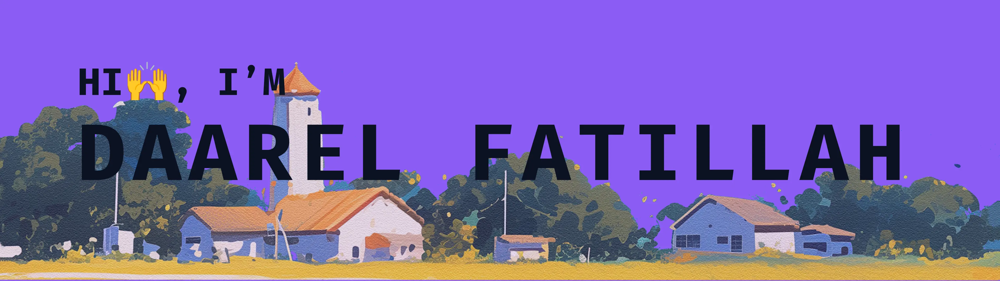

  

 

  <h3>I Code With</h3>
  
  
  
  
  
  
  
  
  
  
  
  
  
  
  
  
  
  
  

 

  <h3>About Me</h3>
  

    I'm a Full-Stack Web Developer and a final-year Informatics undergraduate. I have a strong passion for transforming complex ideas into responsive, high-performance, and user-friendly web applications. As a self-learner, I care deeply about clean code, scalable architectures, and best practices.
  

  <ul>
    <li>Experienced in building modern apps with React.js, Next.js, TypeScript, and Tailwind CSS</li>
    <li>Meta Front-End Developer Professional Certified & DBS Foundation Full-Stack Scholarship Awardee</li>
    <li>Passionate about integrating AI into functional applications</li>
    <li>Open for professional roles, internships, or collaborative projects to strengthen digital presence</li>
  </ul>

 

  <h3>Code, Commit, Repeat</h3>
  

   
  
  

